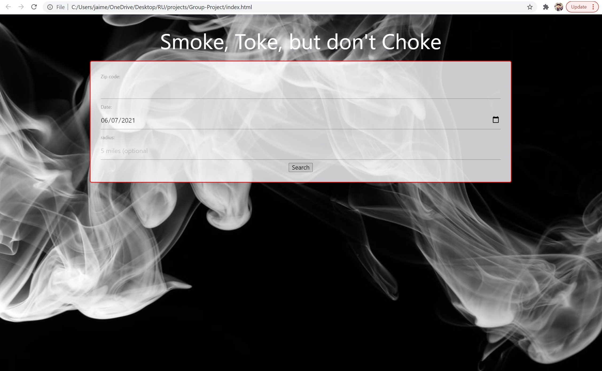
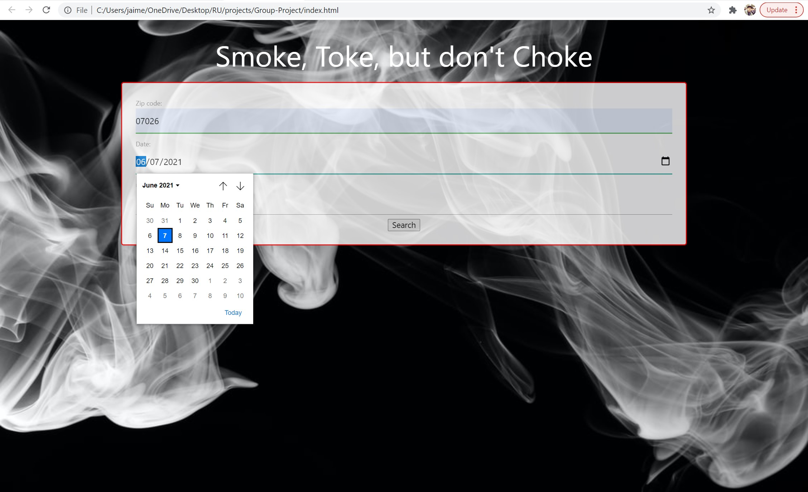
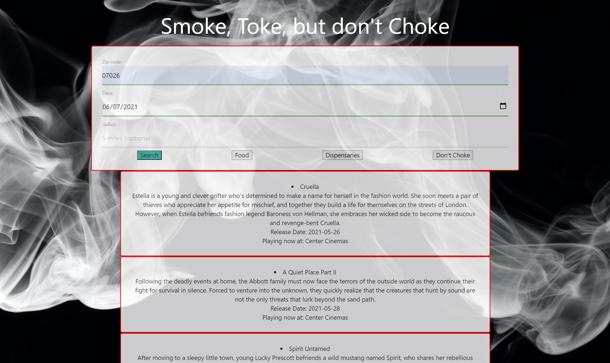
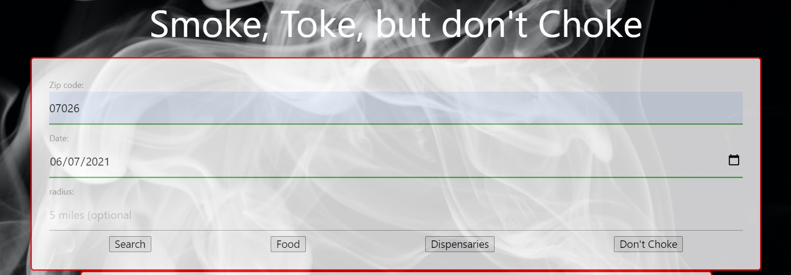
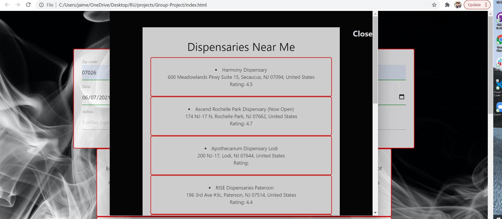
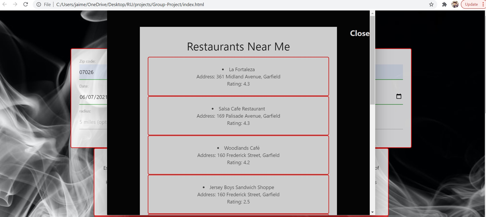
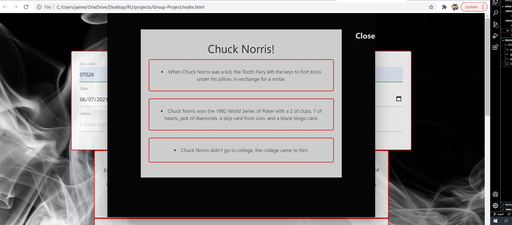

## Group Challenge: Smoke Sesh Dashboard

1. [ Description. ](#desc)
2. [ Web Address. ](#web-address)
3. [ Usage tips. ](#usage)
4. [ Contributing. ](#adaptations)

## 1. Description

### This application is Smoke Sesh Dashboard, created using Google Places API, Javascript, Jquery, Materialize, MomentJs, GraceNote API, ChuckNorris.io API and CSS.

This application is to eventually add information on Cannabis and to plan relaxing activities to do.

## 2. How to Get There

### Open your favorite web browser and enter the following web address to access.

https://jaimevilches87.github.io/Group-Project/

## 3. Usage Tips

### Testing the application

#### Enter a zipcode and date from calendar

### Click on Movies button to display movies playing in your area with title, description, release date, and nearby theatre.

### New Buttons will appear in the search box to display nearby dispensaries and restaurants.

### If Don't Choke button is clicked a funny Chuck Norris Joke will pop up to bring a laugh during your smoke session.

## 4. Future Adaptations
Potential for future enhancements are endless. What started as a fun idea can be utilized to help people deal with Anxiety and Mental health, could be used for  Partnerships between doctors and dispensaries to guide new patients to an "All-In-One" site. Where you can feel confortable planning ideas and educating yourself on the medical attributes of Cannabis.
